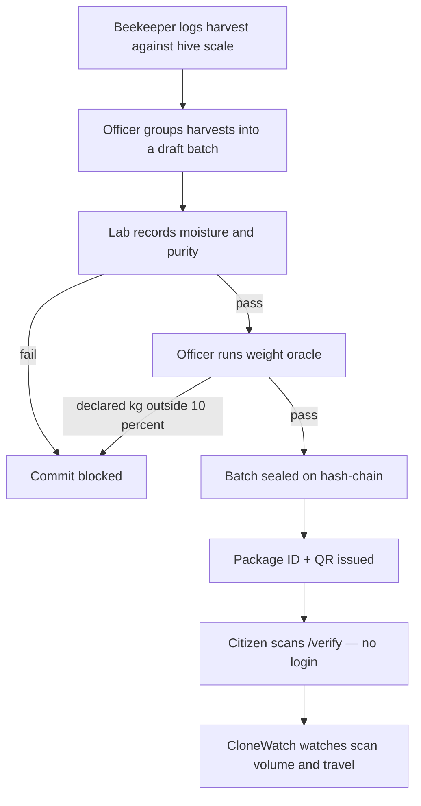
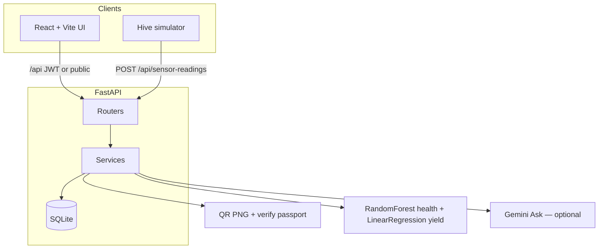

# HoneyChain

**Evidence-backed honey intelligence for KVIC’s Honey Mission.**

HoneyChain is a government-facing platform that follows one physical story:

**Hive signals → harvest log → lab inspection → weight oracle → hash-chain seal → QR → consumer verify.**

A KVIC officer can prove a batch’s path. A lab can block a bad jar. A beekeeper can log a harvest against the hive scale. A buyer can check a package with no account.

This is a **hackathon prototype**. Hive telemetry is simulated. The ledger is a **local SHA-256 hash-chain**, not a public blockchain. The first boot loads a one-time synthetic seed; every new harvest, batch, scan, and model inference after that is live-computed.

| | |
| --- | --- |
| **Live app (API + UI)** | https://honeychain-y8j6.onrender.com |
| **Frontend (proxies `/api` to Render)** | https://honey-chain-coral.vercel.app |
| **Local UI** | http://127.0.0.1:5173 |
| **Local API / docs** | http://127.0.0.1:8000 · http://127.0.0.1:8000/docs |

Use the **Render** URL for judging. QR codes, login, and verify stay on one host. A cold start after idle can take 30–60 seconds.

---

## Table of contents

1. [Problem statement](#problem-statement)
2. [Problem solution](#problem-solution)
3. [Business model (B2G)](#business-model-b2g)
4. [User flow](#user-flow)
5. [Logins and use cases](#logins-and-use-cases)
6. [How each feature solves each problem](#how-each-feature-solves-each-problem)
7. [Website guide](#website-guide)
8. [Technical architecture](#technical-architecture)
9. [Setup and run](#setup-and-run)
10. [Deploy](#deploy)
11. [What is simulated vs real](#what-is-simulated-vs-real)
12. [Known gaps](#known-gaps)
13. [Conclusion](#conclusion)

---

## Problem statement

Four problems from the original SIH / Honey Mission brief, unchanged:

1. **Counterfeit honey** — adulterated or mislabelled jars reach the market. There is no reliable check that the kilograms on the label match what left the hive, and no shared record a field officer can defend.
2. **Low consumer trust** — a buyer is asked to believe a sticker. There is no simple, public check they can run themselves.
3. **Weak market linkages** — beekeepers rarely see standing demand or a transparent price. Sale often depends on a middleman.
4. **Lack of traceability and hive-management support** — field officers cannot prove a batch’s path from hive to shop, and beekeepers have little support for colony health and harvest records.

These are **governance problems**, not only shop-floor problems. KVIC’s Honey Mission needs a field system of record: who harvested, what the scale said, whether the lab passed the batch, and whether the jar a citizen scans still matches that chain.

---

## Problem solution

HoneyChain is a role-scoped web system for KVIC clusters.

| Gap | What HoneyChain does |
| --- | --- |
| Counterfeit honey | Harvest weight is corroborated against the hive scale. A **weight oracle** allows commit only if declared kg stay within **10%** of sensor-logged harvests. Lab **pass** is required before commit. A passing batch is sealed on a hash-chain. CloneWatch flags implausible scans and oracle failures. |
| Low consumer trust | Anyone opens `/verify` with no login. The passport recomputes ledger integrity from live rows. A QR on the package points at that page. |
| Weak market linkages | A demand board shows standing buyers and recent verified sale prices. Live listings are separated from example/seed rows. |
| Traceability and hive care | Role-gated harvests, batches, lab desk, ledger, and cluster view. Colony insights classify inspection-risk from live temperature/humidity and explain **why**. |

**What this is not:** a public blockchain, an ESP32 firmware product, or a veterinary diagnosis engine. The prototype proves the **workflow and the rules**. Hardware and a national chain can sit on the same APIs later.

---

## Business model (B2G)

HoneyChain is **business-to-government**, not a consumer app that sells jars.

**Buyer:** KVIC and allied Honey Mission / state horticulture / cluster agencies. They procure a hosted system of record for the clusters they already fund.

**Users (not payers):** beekeepers, field officers, lab inspectors, and citizens. The citizen never pays to verify a jar. That is a public good the mission already owes the market.

**What government is buying**

- A cluster operating system: hive register, harvest log, lab queue, oracle, ledger, QR passport.
- Inspection capacity: CloneWatch and lab-gated commit instead of paper that can be copied.
- Farmer-facing tools: own-hive dashboard, insights, demand board — so the mission’s income goal is not only a poster.
- A public verify URL that any FSSAI awareness campaign can print on a pack.

**How it is sold**

| Motion | Meaning |
| --- | --- |
| **Licence per cluster / per district** | Annual SaaS for one KVIC cluster: officers, lab desk, beekeeper accounts, hosted API. |
| **Per-hive telemetry add-on** | Optional once real scales exist. This prototype uses the same `/api/sensor-readings` a field node would call. |
| **Mission rollout, not app-store** | Onboarding is staff accounts + beekeeper register, languages already in the UI, not a B2C download campaign. |

**Why B2G fits**

- Trust in honey is a **regulatory** outcome. A private brand ledger does not bind the next packer.
- Officers and labs are already on the government payroll. The software has to match their desks.
- Consumers must verify **without an account**, or the mission still fails the trust test.
- Market linkage is a public marketplace overlay, not a commission-taking private exchange in this design.

Revenue is the government contract. Impact is authentic kg on the ledger and a jar a citizen can check.

---

## User flow

End-to-end path from colony to citizen:



**Day in the product**

1. A hive has temperature, humidity, and weight (simulator in this prototype; starter readings on a newly registered hive).
2. The beekeeper logs kg and moisture on **My Harvests**. The API refuses a harvest with no scale reading.
3. The officer creates a **pending** draft. Oracle commit before lab pass is refused.
4. The lab records a **pass**. The officer runs oracle + commit. A **new** package ID and QR appear.
5. Anyone verifies that ID on **Verify your honey**. Repeat scans in impossible places surface on **CloneWatch**.
6. Buyers and keepers meet on **Market Linkage**. The model card stays honest about held-out scores.

---

## Logins and use cases

Beekeepers: **Sign in** at `/login` or **Register** at `/register`. Use the **short username**, not only the display name. Staff: `/staff` or `/login`.

Seeded demo accounts (first backend start):

| Role | Username | Password | Lands on | Use case |
| --- | --- | --- | --- | --- |
| Beekeeper | `beekeeper` | `Beekeeper123!` | `/app/dashboard` | Own hives, harvest, monitor, insights, market, report |
| KVIC officer | `officer` | `Officer123!` | `/app/cluster` | Cluster, batch review, alerts, ledger, CloneWatch, market |
| Lab inspector | `lab` | `Lab123!` | `/app/lab` | Pending drafts: moisture, purity, pass/fail |
| KVIC admin | `admin` | `Admin123!` | `/app/dashboard` | Full system, users, model, analytics, tamper-test |
| Consumer | — | — | `/` `/verify` | No login. Passport + public market + model card |

Self-registration creates a beekeeper, assigns a hive, and writes starter scale readings so harvest and insights work on hosted demo (no local simulator).

**Do not** use forgot-password with a made-up code. Request a reset, copy the **6-digit** demo code, then save the new password.

### Beekeeper

Sees only assigned colonies. Logs and corrects pending harvests. Reads live monitor and inspection-risk insights. Posts interest on live demand. Exports a personal harvest/sale report.

### KVIC field officer

Sees the cluster in their region. Drafts batches, runs oracle after lab pass, reads ledger integrity and CloneWatch, posts demand.

### Lab inspector

Sees drafts with `lab_test_result == pending`. A fail blocks commit. A pass unlocks oracle.

### KVIC admin

Registers hives (optional beekeeper assignment + starter telemetry), manages staff, runs tamper-test, reads cluster analytics. Analytics pins are **regional centroids, not live GPS**.

### Consumer

Home trust counts, How it works, Verify, public market, public model card. Never asked to create an account to check a jar.

---

## How each feature solves each problem

| Feature | Counterfeit | Consumer trust | Market linkage | Traceability / hive care |
| --- | --- | --- | --- | --- |
| Hive register + starter / live telemetry | Scale is the source of harvest kg | Public hive counts | — | Colony record for the officer |
| My Harvests | Declared kg tied to last scale reading | — | Volume for later sale | Beekeeper’s own log |
| Lab desk | Fail blocks a dishonest or wet batch | — | — | Independent check |
| Weight oracle (10%) | Over-declared batches cannot seal | — | — | Officer has a hard rule |
| Hash-chain ledger + tamper-test | Sealed batch cannot silently change | Verify recomputes hashes live | — | Path from hive to package |
| Package QR | Physical jar points at one ID | Scan with no account | — | Package is the shop-facing record |
| Consumer Verify | Fake IDs fail integrity | Public passport | — | Anyone can audit |
| CloneWatch | Repeat / impossible scans flagged | — | — | Officer sees abuse |
| Colony insights | — | Public model card keeps scores honest | — | Inspection-risk + **why** |
| Market Linkage | — | — | Live demand vs example listings | Beekeeper sees price |
| Multilingual UI + Ask | — | Citizen can read the passport | — | Field users in 7 languages |
| Role-gated JWT | Staff cannot wear each other’s desks | — | — | Access is part of traceability |

**Demo-ready loop:** harvest → pending draft → lab pass → oracle commit → **new** package + QR → Verify (not only seed `PK-LIVE`).

---

## Website guide

Prefer https://honeychain-y8j6.onrender.com so QR and API share a host.

### Public (no login)

| Page | Where | What to do |
| --- | --- | --- |
| Home | `/` | Trust counts from `/api/public/stats`. Switch language. |
| How it works | `/how-it-works` | Four steps: sensors → batch/lab → ledger → QR. |
| Model card | `/model` | Held-out health accuracy **40.0%**. Say that number. Do not inflate it. |
| Market preview | `/market` | Public demand/sales. Sign in to trade. |
| Verify | `/verify` | Try `PK-LIVE`, then a package you just issued. |
| Sign in / Register / Staff | `/login` `/register` `/staff` | Beekeeper vs KVIC desk. |

### After sign-in

| Feature | Route | Guide |
| --- | --- | --- |
| Dashboard | `/app/dashboard` | Beekeeper: own colony. Admin: hive picker, live temps, **Register a hive** (assign keeper, starter readings). |
| Hive monitor | `/app/monitor` | Charts of temperature, humidity, weight. |
| My Harvests | `/app/harvests` | Pick hive → Review harvest → Create harvest. Empty hive list means refresh once so an assigned hive can appear. |
| Batch review | `/app/batches` | Log harvest if needed, create **pending** draft, wait for lab, then **Run oracle and commit**. **JUST ISSUED** is the new QR. |
| Lab desk | `/app/lab` | Select queued draft, record pass/fail. |
| Ledger | `/app/ledger` | Recomputed chain. Admin: tamper-test then reset. |
| CloneWatch | `/app/clonewatch` | Oracle failures and flagged scans. |
| Insights | `/app/insights` | Status, confidence, class probabilities, reasons, top features. Not a disease name. |
| Market | `/app/market` | Live board first. Seed rows only under **Example listings**. |
| Alerts | `/app/alerts` | Local queue only — not WhatsApp. |
| Users | `/app/users` | Admin creates officer / lab / admin. |
| Analytics | `/app/analytics` | Map + kg from ledger-linked sales. |
| Ask | orange **Ask** | Same language as the question. Needs `GEMINI_API_KEY` on the server for full Gemini; otherwise live records. |
| Tour | Start tour | Beekeeper and officer. Docked card; Finish to exit. |

**Judging path (short):** home → verify `PK-LIVE` → admin harvest → pending draft → lab pass → oracle commit → verify **new** ID → CloneWatch → market → model 40%.

---

## Technical architecture



| Layer | Choice | Why |
| --- | --- | --- |
| API | FastAPI, Python 3.11 | Original hive/sensor JSON contracts stay stable. |
| Data | SQLAlchemy + SQLite | One file for the prototype. Render disk is ephemeral. |
| Auth | bcrypt + JWT access (15 min) + refresh | Role gates on every staff desk. |
| UI | React 18, Vite, i18next | Seven Indian languages; IDs and hashes stay untranslated. |
| Oracle | 10% band vs sum of sensor-logged harvest kg | Hard anti-overdeclare rule. |
| Ledger | SHA-256 of canonical batch JSON + previous hash | Integrity is recomputed, not a stored tick. |
| QR | PNG of `{public origin}/verify?package_id=…` | `HONEYCHAIN_PUBLIC_ORIGIN` so production QR is not localhost. |
| ML | MSPB D1/D2, live temp/humidity only | Inspection-risk, not pathogen ID. Weight forecast is this hive’s scale. |
| Ask | Gemini if keyed, else grounded fallback | Answers in the question’s language. |

**Repository**

```
HoneyChain/
  backend/     FastAPI app, services, routers, seed
  web/         React UI (judging interface)
  simulator/   Multi-hive telemetry generator
  ml/          MSPB prep, training, metrics
  tests/       pytest
  frontend/    Streamlit leftover — not the judging UI
```

**Main API groups:** `/api/hives` `/api/sensor-readings` `/api/harvests` `/api/batches/{id}/commit` `/api/lab` `/api/packages` `/api/verify` `/api/clonewatch` `/api/insights` `/api/auth` `/api/public/*` `/api/assistant/ask`

---

## Setup and run

**Prerequisites:** Python **3.11**, Node 20+, Git. `numpy` is pinned to **2.4.6** (2.5.x needs Python 3.12). `requirements.txt` must stay **UTF-8**.

```powershell
git clone https://github.com/krishnakeshab-banik/HoneyChain.git
cd HoneyChain
python -m venv .venv
.venv\Scripts\activate
pip install -r requirements.txt
cd web
npm install
cd ..
copy .env.example .env
```

Never commit `.env`.

| Variable | Purpose |
| --- | --- |
| `GEMINI_API_KEY` | Ask / photo notes. Set on **Render**, not only locally. |
| `HONEYCHAIN_JWT_SECRET` | Production JWT secret. |
| `HONEYCHAIN_PUBLIC_ORIGIN` | Public QR host, e.g. `https://honeychain-y8j6.onrender.com` |
| `CORS_ORIGINS` | Extra UI host, e.g. Vercel. |
| `HONEYCHAIN_DATABASE_URL` | Optional. Default `honeychain.db`. |
| `PYTHON_VERSION` | Render: `3.11.9` |

Three terminals from the repo root:

```powershell
python -m uvicorn backend.main:app --reload --host 127.0.0.1 --port 8000
python simulator/hive_simulator.py
cd web
npm run dev
```

Open http://127.0.0.1:5173. `python -m pytest` walks telemetry → harvest → oracle → ledger → QR → verify.

Seed helpers: `python -m backend.seed` and `python -m backend.seed --reset` (reset refuses if live ledger blocks exist).

---

## Deploy

**Render (recommended):** Python 3 web service, branch `main`.

- Start: `uvicorn backend.main:app --host 0.0.0.0 --port $PORT` — not Django gunicorn.
- Build installs pip deps, Node 20, then `cd web && npm ci && npm run build` so FastAPI serves `web/dist`.
- Env: `PYTHON_VERSION=3.11.9`, generated JWT secret, `GEMINI_API_KEY`, `HONEYCHAIN_PUBLIC_ORIGIN`.
- No simulator process on Render. SQLite resets on deploy.

**Vercel (optional UI):** Vite root `web`. Rewrites `/api/*` and `/health` to Render; other paths to `index.html`. Do not set `VITE_API_URL` if those rewrites are on.

See `render.yaml` and `vercel.json`.

---

## What is simulated vs real

| Piece | Honest status |
| --- | --- |
| Hive sensors | Simulated (`source=simulated`). No ESP32. New hives get starter readings so the hosted demo is usable. |
| Harvest / batch / package | Real SQLite application logic. |
| Oracle | Real 10% weight rule. |
| Ledger | Real local hash-chain. Not Fabric or Polygon. |
| QR + verify | Real PNG + live recompute. |
| CloneWatch | Real rules on those scans. Scan cities are presets. |
| Health / yield models | Real sklearn. **40%** held-out health accuracy. |
| Ask HoneyChain | Gemini if keyed; else live records + product facts. |
| Alerts | Local queue. No SMS/WhatsApp gateway. |
| Seller map | Regional centroids, not live GPS. |

---

## Known gaps

- Self-registration and password reset work for the demo path; they are not a production identity provider.
- Conversational Ask needs `GEMINI_API_KEY` on the server.
- 40% colony-health accuracy is truthful, not a strong classifier.
- Hosted demo has no always-on simulator; starter readings cover new hives.
- No public blockchain, live GPS, or WhatsApp/SMS gateway.

---

## Conclusion

Honey Mission fails when a jar is only a label, a harvest is only a notebook, and a beekeeper never sees a price. HoneyChain is the B2G field record for that mission: **scale-backed harvests, lab-gated commit, a hash-chain a citizen can recompute, and a demand board that is not a middleman’s whisper.**

The prototype is honest about what it is. Sensors are simulated. The chain is local. The health model is a weak inspection-risk score and says so. What is not simulated is the rule set government actually needs: you cannot seal kilograms the hive never carried, you cannot skip the lab, and you cannot hide a broken chain from the person holding the jar.

That is the product to procure, cluster by cluster — not another poster, and not a private blockchain slogan. A verified kilogram in a KVIC district is the finish line.
